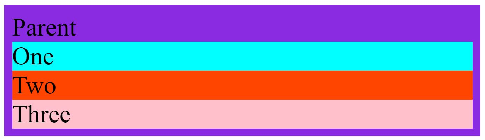

# Introduction
---
In this article we will have a look at the fundamental concept of the CSS property *position* to see how we can position our HTML elements on a webpage. By understanding this fundamental concept of positioning, we will appreciate later features such as CSS grid and CSS Flexbox so much more. 

When we talk about the the CSS property *position*, we talk about these values : 

* Static
* Relative
* Absolute
* Fixed
* Sticky

## Static
---
Let's go through each and everyone of them one by one. We start by writing our boilerplate HTML and then add a parent div element to it, and inside of this div we add three more div's. These will act as children elements and we also give them appropriate classnames so that we can target them in our CSS. In the head-tag we also add style tags, without any positioning properties, just some background colours and padding. 

```html
<!DOCTYPE html>
<html lang="en">
<head>
    <meta charset="UTF-8">
    <meta http-equiv="X-UA-Compatible" content="IE=edge">
    <meta name="viewport" content="width=device-width, initial-scale=1.0">
    <title>Understanding CSS Positioning</title>

<style>

.parent{
    background-color: blueviolet;
    padding: 5px;
 }

 .child-one{
    background-color: aqua;
 }

 .child-two{
    background-color: orangered;

 }

 .child-three{
    background-color: pink;

 }
</style>
    
</head>
<body>
    <div class="parent">
        Parent
        <div class="child-one child">One</div>
        <div class="child-two child">Two</div>
        <div class="child-three child">Three</div>
    </div>
</body>
</html>
```



The above HMTL and CSS code gives this result. We can now visually see our container and three children inside of it. At the moment we have not in our CSS applied any positioning properties. If we open the above code in Google Chrome, press F12 and open up developers tool. We can inspect our CSS and discover that by default position with the value static is being applied, probably by the browser (computed style). So, *static* is the default position all of our elements will have when they enter onto the page. All static positiong says is that it should follow the other documents in the flow. What comes first in our HTML, will be displayed first, and then the second element and so on. 

## Relative
---
The next position we will look at is *relative* positioning, it works almost like static positioning. Let's say thet we now want to change the position of child "One", in the CSS we add the property *position* and then the value *relative*. Looking at our document in the browser, it looks exactly the same as before applying this property; nothing has changed. That is because relative positioning work just like static positioning. However, there is a small difference. By using relative on the child element "One" we can now use the properties top, left, bottom and right to change the position of our element. 

```html
<!DOCTYPE html>
<html lang="en">
<head>
    <meta charset="UTF-8">
    <meta http-equiv="X-UA-Compatible" content="IE=edge">
    <meta name="viewport" content="width=device-width, initial-scale=1.0">
    <title>Understanding CSS Positioning</title>

<style>
 .parent{
    background-color: blueviolet;
    padding: 5px;
 }

 .child-one{
    background-color: aqua;
    position: relative;
    left: 10px;
 }

 .child-two{
    background-color: orangered;

 }

 .child-three{
    background-color: pink;

 }
</style>
    
</head>
<body>
    <div class="parent">
        Parent
        <div class="child-one child">One</div>
        <div class="child-two child">Two</div>
        <div class="child-three child">Three</div>
    </div>
</body>
</html>
```

In our CSS-file we add 'left : 10px' to child element "One". 


Above screenshot shows that child element "One" shifts 10px to the right and overflowing beyond its parent element. This means that relative allows you to change the position of the element relative to where it normally would be in the document flow if it was statically positioned. We can also give it the value 'top : 10px' and it would shift 10px downwards and overflow into child element "Two". 


Above screenshot is showing how element "One" is flowing into element "Two" as we add 'top: 10px' in its CSS. In fact by applying relative and the properties top, left, right or bottom, the element gets removed from the document flow. That is why elements "two" and "three" do not change their position, as element "One" is being pushed down, it is actually removed from the document flow so that it doesn't work like a statically positioned element. In fact, you will never work with position releative and top,left, bottom or right, because this combination removes the element from the document flow and it becomes difficult to style elements around it. 

## Absolute
---
The next *position* property we will cover is *absolute*. Let's do some modifications to our CSS by removing relative, add absolute and also remove 'top: 10px'. 

```html
<!DOCTYPE html>
<html lang="en">
<head>
    <meta charset="UTF-8">
    <meta http-equiv="X-UA-Compatible" content="IE=edge">
    <meta name="viewport" content="width=device-width, initial-scale=1.0">
    <title>Understanding CSS Positioning</title>

<style>
 .parent{
    background-color: blueviolet;
    padding: 5px;
 }

 .child-one{
    background-color: aqua;
    position: absolute;
 }

 .child-two{
    background-color: orangered;

 }

 .child-three{
    background-color: pink;

 }
</style>
    
</head>
<body>
    <div class="parent">
        Parent
        <div class="child-one child">One</div>
        <div class="child-two child">Two</div>
        <div class="child-three child">Three</div>
    </div>
</body>
</html>
```


The above screenshot shows that things changed quite a lot when we applied 'position : absolute' to child element "One". Now, all the other elements are behaving like if element "One" was not there, it has been removed from the document flow. This feature is very useful when you want an element to stick to a particular position and everything else around it should not move. With absolute, we can also use top, left, right and bottom properties. Now, if we apply 'top:10px' to child element "One".

```css

.child-one{
    background-color: aqua;
    position: absolute;
    top:10px;
 }
 ```

Something weird happens. Element "One" has now shifted 10px away from the top of our window, and if we put *top* to 0px, it sticks to top of our window. You would think that it would position itself 10px below its parent element, but that is not the case, because that is what *relative* position does and besides, the parent element has position *static*, so it cannot have any other elements positioned to it. Absolute position, absolutely positiones an element inside some parent container that it can reference. 


```css
.child-one{
    background-color: aqua;
    position: absolute;
    top:0px;
 }
 ```


 


Now let's change the position of the parent element from *static* to *relative* and see what happens. 

```html
<style>
 .parent{
    background-color: blueviolet;
    position: relative;
    padding: 5px;
 }

 .child-one{
    background-color: aqua;
    position: absolute;
    top:0px;
 }
 ```
 

 Now we see that the child element "One" is sticking to the top of its parent, as we apply position relative to the parent element. In fact absolute and relative positioning go very well together because any element that is relatively positioned can have absolutely postioned element inside of it that will be relative to that relative-positioned element. This will work for every position not just relative position. 

 ## Fixed
 ---
Fixed positioning is very similar to absolute positioning, but there are some minor differences. 

```html
 <style>
 .parent{
    background-color: blueviolet;
    position: relative;
    padding: 5px;
 }

 .child-one{
    background-color: aqua;
    position: fixed;
    top:0px;
</style>
```

We apply some changes to our styling inside the HTML document by giving child element "One" position *fixed* and 'top : 0px'. Parent element has the position value of *relative*. 


We see that once applied, child element "One" completely ignores its parent element and sticks to the top of the window. That is because fixed positioned elements are always fixed positioned based on the entire HTML document, it has nothing to do with parent element. Also, fixed positioned elements stay in the same position when you scroll. 

## Sticky 
---
Sticky position is a combination of both relative position and fixed position. 

```html
<style>
 .parent{
    background-color: blueviolet;
    position: relative;
    padding: 5px;
    height: 200vh;
 }

 .child-one{
    background-color: aqua;
    position: sticky;
    top: 0;
 }
</style>
```

We change up our code a bit by giving the parent element position of relative, height of 200vh. At the same time we give the child element "One" position sticky and top is equal to 0. 


We observe that it looks like normal as if it was relatively positioned, but as we scroll down in the browser, element "One" hits the top of the browser, the child element "One" is fixed to the top (since top value is set to 0) and it stays there as we continue to scroll. 


Above screenshot is showing that child element "One" becomes fixed as the element hits the top of the window, which is set to 0.

And that concludes our article about positioning in CSS, a fundamental concept that is crucial to understand as we continue our journey in web-development. 

Thank you for reading.